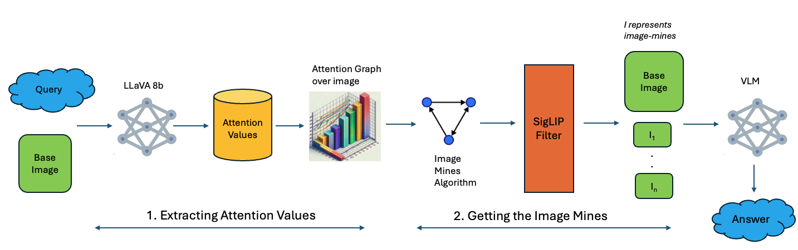

# Visual Prompting Through Image-Mines [](https://www.python.org) [](https://jupyterlab.readthedocs.io/en/stable)

This repository contains all the codes for the paper, _Visual Prompting Through Image Mines_ submitted at [ICIP 2025](https://2025.ieeeicip.org/)

## Abstract
Visual prompting aims to enhance the performance of vision-language models (VLMs), which, despite their remarkable capabilities, often struggle with dense, detailed images, leading to incorrect answers or hallucinations. We propose _Visual Prompting Through Image Mines_, a novel algorithm that leverages attention patterns from a base VLM to generate image crops for improved visual grounding. Specifically, we extract attention values from output text tokens in the LLaVA-8B model, overlay them onto image patches to create an attention graph, and apply a modified breadth-first search (BFS) to identify key regions as image crops. Using the SigLIP model, we refine these regions into _Image Mines_, retaining only the most relevant crops. Our approach supports both single-image and multi-image inference setups, demonstrating superior performance compared to existing visual prompting methods.

## Overview


## Getting Started
Follow the instructions below to setup the code on your local system<br>

1. Clone this repository
```bash
git clone https://github.com/Snehan2k2/Image-Mines
cd Image-Mines
```
2. Create a virtual environment
```Shell
python -m venv image_mines_env
source image_mines_env/bin/activate
pip install --upgrade pip  # enable PEP 660 support
pip install -r requirements.txt
```

## Contributors
- [Kalash Shah](https://github.com/Kalash1106)
- [Snehan J](https://github.com/Snehan2k2)
